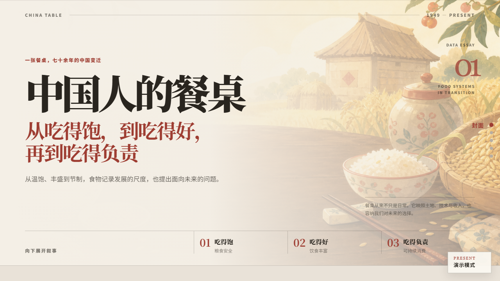
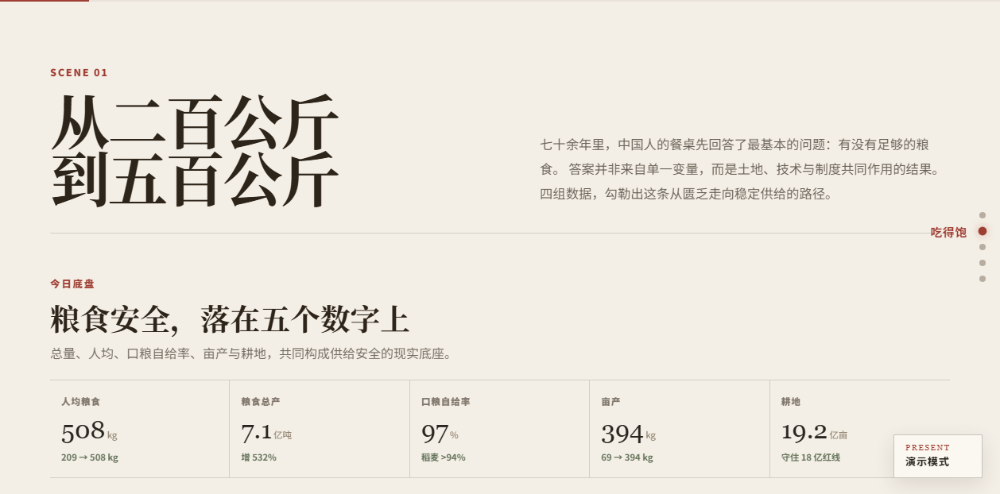
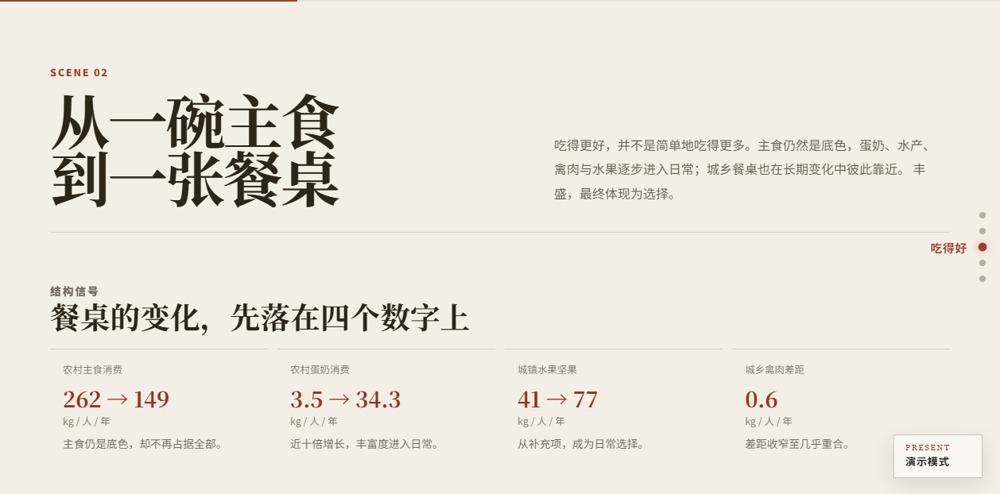
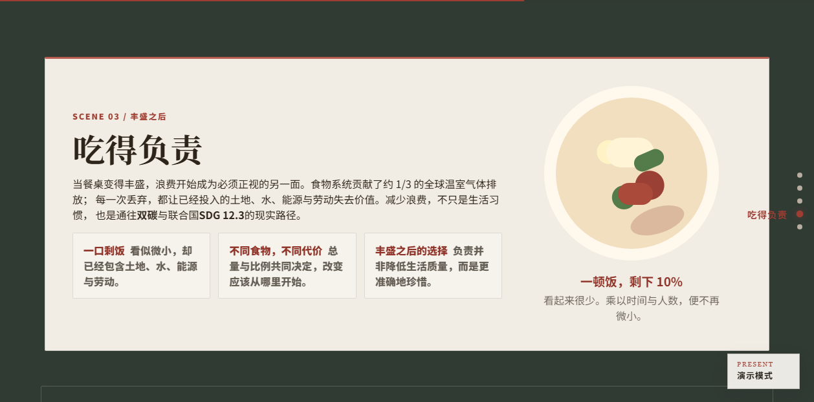
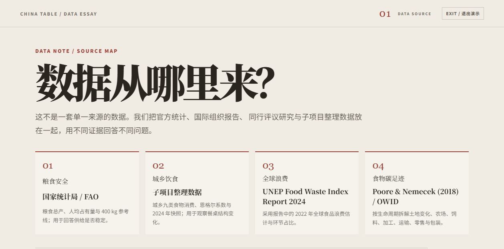

# 中国人的餐桌

一个基于 **Vue 3 + D3.js** 的数据叙事可视化项目。作品围绕中国人的餐桌变迁展开，讲述从“吃得饱”到“吃得好”，再到“吃得负责”的长期变化。

它不是传统 dashboard，而是一篇可滚动阅读的数据专题：读者沿页面向下进入不同章节，在文字、场景图、指标卡片和交互图表之间理解粮食安全、饮食结构、食品浪费与环境代价。

## 项目展示

### 1. 封面：一张餐桌，七十余年的中国变迁

项目以餐桌场景作为入口，用“吃得饱、吃得好、吃得负责”三段式结构组织整篇数据故事。读者可以从封面直接进入章节，也可以通过右侧导航快速跳转。



### 2. 吃得饱：粮食安全的底盘

第一章聚焦粮食供给能力，通过人均粮食占有量、粮食总产、口粮自给率、亩产与耕地等指标，解释中国餐桌从匮乏走向稳定供给的过程。章节中包含指标卡片、翻转图表和可展开的分析面板。



### 3. 吃得好：饮食结构的变化

第二章关注饮食结构升级。页面从恩格尔系数、主食消费、乳制品、水果坚果、禽肉等维度展示餐桌如何从“吃饱”继续走向“吃得更丰富”，并通过城乡对照呈现生活方式的接近与差异。



### 4. 吃得负责：丰盛之后的选择

第三章讨论食品浪费与环境代价。项目将浪费结构、浪费率、资源足迹和供应链碳排放放在同一条叙事线上，让读者看到“被丢掉的从来不只是食物”。



### 5. 数据来源演示模式

右下角的 `PRESENT / 演示模式` 按钮会打开一页式数据来源说明，用于课堂展示、项目答辩或快速解释数据依据。



## 在线部署

项目通过 GitHub Pages 部署，Vite `base` 已配置为：

```js
base: "/26DataVis.hw4/";
```

推送到 `main` 分支后会触发 `.github/workflows/deploy.yml`，自动安装依赖、执行构建，并将 `dist/` 发布到 GitHub Pages。

## 功能亮点

- **滚动叙事**：以章节推进故事，而不是把所有图表堆在同一个仪表盘中。
- **章节导航**：右侧导航可快速跳转到封面、三章正文和结尾。
- **视觉场景图**：封面、饮食丰富、负责消费等章节使用餐桌主题图片建立叙事氛围。
- **D3 图表交互**：折线图、堆叠面积图、环形图、柱状图、生命周期图等支持 tooltip 或状态切换。
- **粮食安全卡片**：点击卡片翻面查看对应图表，并可展开进一步分析。
- **演示模式**：右下角 `PRESENT / 演示模式` 按钮可打开一页式数据来源说明，按 `Esc` 或点击退出返回正文。
- **部署自动化**：GitHub Actions 自动构建并发布 GitHub Pages。

## 技术栈

- Vue 3
- Vite
- D3.js
- CSS Modules / scoped CSS
- IntersectionObserver
- GitHub Actions + GitHub Pages

## 本地运行

建议使用 Node.js 22，与 GitHub Actions 部署环境保持一致。

```bash
npm install
npm run dev
```

开发服务器默认会输出类似地址：

```text
http://127.0.0.1:5173/26DataVis.hw4/
```

本地预览生产构建：

```bash
npm run build
npm run preview
```

## 常用命令

```bash
npm install      # 安装依赖
npm run dev      # 启动开发服务器
npm run build    # 生成生产构建
npm run preview  # 本地预览 dist
```

## 页面结构

```text
src/
  App.vue
  main.js

  components/
    layout/
      Hero.vue
      StoryMarquee.vue
      SectionNav.vue
      SceneTitle.vue
      EnoughSection.vue
      BetterDietSection.vue
      ResponsibleWasteSection.vue
      FinalSection.vue
      PresentationDeck.vue

    charts/
      MetricCards.vue
      PerCapitaLineChart.vue
      GrainStackedArea.vue
      WorldComparisonBar.vue
      AgriTechnologyTrend.vue
      EngelCoefficientChart.vue
      DietStructureDonutChart.vue
      DietConsumptionTrendChart.vue
      DietUrbanRuralSnapshotChart.vue
      FoodWasteCompositionChart.vue
      FoodWasteRateChart.vue
      FoodWasteEnvironmentalImpactChart.vue
      FoodSupplyChainChart.vue
      FinalTimeline.vue

    visuals/
      PlateComparison.vue
      ResponsiblePlate.vue

  data/
    scene1Data.js
    dietConsumptionData.js
    dietStructureData.js
    wasteImpactData.js
    foodWasteCompositionData.js
    foodWasteRateData.js
    foodWasteEnvironmentalImpactData.js
    responsibleChoiceData.js
    carbonFootprintData.js

  styles/
    variables.css
    global.css

  utils/
    chartUtils.js
    useScrollReveal.js
    useScrollStep.js
```

## 章节说明

| 章节 | 主题 | 主要内容 |
| --- | --- | --- |
| Scene 01 | 吃得饱 | 粮食总产、人均粮食占有量、口粮自给率、亩产、耕地与全球对比 |
| Scene 02 | 吃得好 | 恩格尔系数、九类食物消费、城乡饮食差异与 2024 年结构快照 |
| Scene 03 | 吃得负责 | 食品浪费结构、浪费率、环境资源足迹与食物供应链碳排放 |
| Final | 回到餐桌 | 用时间线收束“供给、丰富、负责”的叙事主线 |

## 数据来源

当前项目混合使用官方统计、国际组织报告、同行评议研究与课程子项目整理数据。

| 模块 | 数据来源 | 用途 |
| --- | --- | --- |
| 粮食安全 | 国家统计局 / FAO | 粮食总产、人均粮食占有量、FAO 400 kg 参考线等 |
| 城乡饮食 | 子项目整理数据 | 城乡九类食物消费、恩格尔系数与 2024 年快照 |
| 全球食品浪费 | UNEP Food Waste Index Report 2024 | 2022 年全球食品浪费估计与家庭、餐饮服务、零售占比 |
| 食物碳足迹 | Poore & Nemecek (2018), Science / Our World in Data | 不同食物的生命周期温室气体排放拆解 |

需要注意：

- 城乡饮食序列存在观测缺口，图中以虚线连接缺口两端。
- 农业科技、耕地等部分指标包含趋势估算，用于呈现长期变化。
- 分类浪费率与环境足迹数组在正式发布前仍需补齐外部引用。

## 截图维护

README 中的截图位于：

```text
docs/screenshots/
```

如果页面视觉或章节结构有较大变化，建议重新截取并覆盖对应图片，保持 README 与实际系统一致。

## 协作建议

- `main` 分支保持可部署状态。
- 大改动建议开 feature 分支，通过 Pull Request 合并。
- 合并前运行 `npm run build`，确认生产构建可通过。
- 如果修改了 `src/data/` 中的数据结构，需要同步检查依赖这些字段的 D3 图表。
